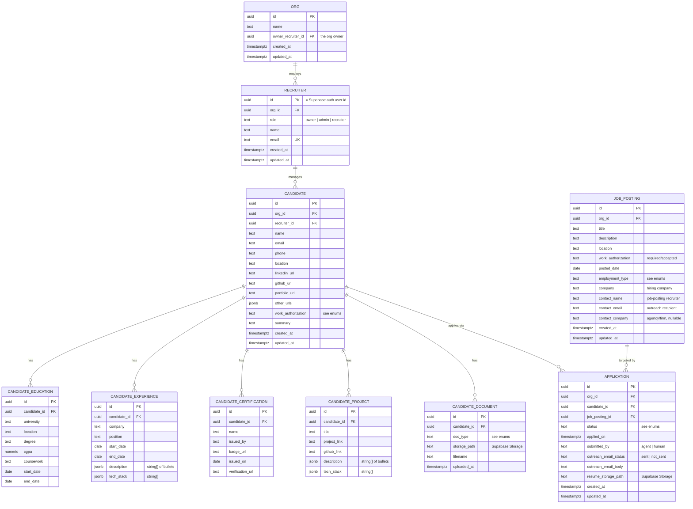

# Callup — Database Schema v1 (skeleton)

Working ERD for the walking-skeleton scope. The matching pipeline (embeddings, fitment
scores, Dice ingestion metadata, a normalized hiring-contact table, the apply-session
state machine, and a separate outreach record) is intentionally **deferred** and will be
added by later migrations as those phases land.

Status: **draft, under review.**

## ERD

## Enumerations

- **recruiter.role:** `owner`, `admin`, `recruiter`.
- **candidate.work_authorization / job_posting.work_authorization:**
  `USC` (US citizen), `GC` (green card), `GC_EAD`, `H1B`, `OPT`, `STEM_OPT`, `L2_EAD`,
  `TN`, `OTHER`. On a candidate it states their status; on a posting it states the
  required/accepted authorization.
- **job_posting.employment_type:** `CONTRACT_C2C`, `CONTRACT_W2`, `FULL_TIME`.
- **application.status:** `draft`, `applied`, `emailed`, `closed` (terminal: rejected /
  filled / withdrawn / gone cold).
- **application.submitted_by:** `agent`, `human`.
- **application.outreach_email_status:** `sent`, `not_sent`.
- **candidate_document.doc_type:** `residency_proof`, `visa_proof`, `i94`, `other`.

## Notes & conventions

- **Tenancy:** `org_id` on every business table marks the owning organization (the
  data-isolation boundary). MVP is single-org; multi-recruiter is later enabled via RLS +
  middleware, never a column-shape migration. Distinct from `recruiter_id`, which is
  candidate ownership within an org.
- **Org & roles:** `org_id` is a FK to `ORG`. `recruiter.role` (`owner | admin |
  recruiter`) and `org.owner_recruiter_id` model who administers the org. Role-based
  permissions (add/remove recruiters, assign candidates, org-level stats) and the admin UI
  are future scope — only the entities and the role column exist now.
- **One recruiter per candidate** for now; a candidate shared across recruiters is a
  future change (would become a join table).
- **Job-posting contact** = the *hiring-side* recruiter the BSR emails outreach to — not
  the bench-sales recruiter. Stored as columns on `job_posting` for the skeleton; may be
  normalized into a contacts table when outreach/enrichment get real.
- **Files in Storage:** tailored resumes and candidate documents live in a Supabase
  Storage bucket; the DB keeps only `*_storage_path` pointers.
- **Application uniqueness:** `unique(candidate_id, job_posting_id)` — a candidate is not
  applied to the same posting twice (re-apply policy default: never).
- All tables carry `created_at` / `updated_at`.

## Deferred to later phases

Candidate `profile_vector` + job `embedding` (pgvector); Dice ingestion fields (`source`,
`external_id`, `content_hash`, `apply_type`, `first_seen`/`last_seen`, `url`); fitment
score (LLM re-rank output); normalized hiring-contact table; apply-session state machine;
separate outreach record (to/cc/subject/sent_at).
